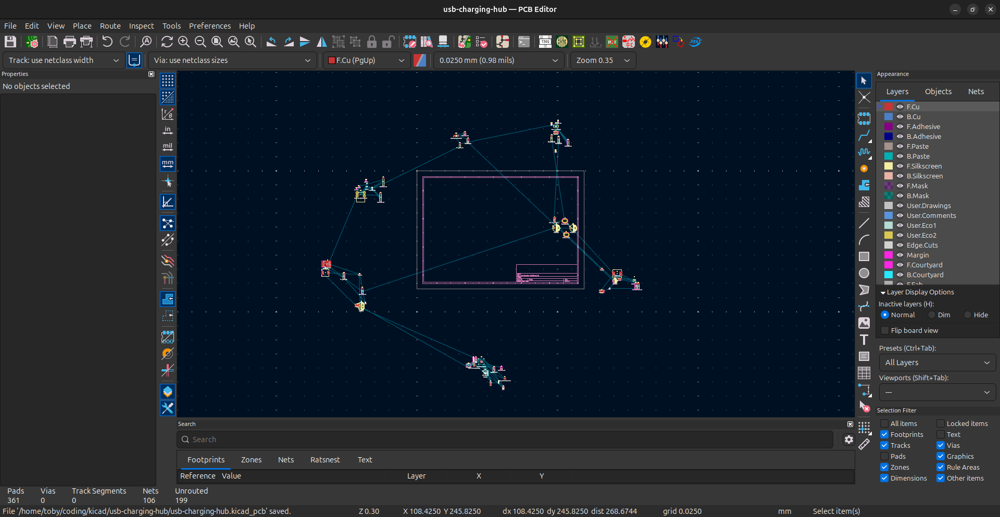

# May 16, 2025

After deciding between implementing my own USB PD stack with the FUSB302 and using an IC with the stack integrated like the TPS25751, I went with the TPS25751 for now, but still looking for better options because the IC is $2.56 each 😭

I also decided that I should split it into small modules, so if I need to change something, I can just change that module instead of the whole board.

# May 17, 2025

made myself a footprint for the inductor :b

Modules grouped:

added all of the GPIO pins labels:

finished routing the RP2350B module:

